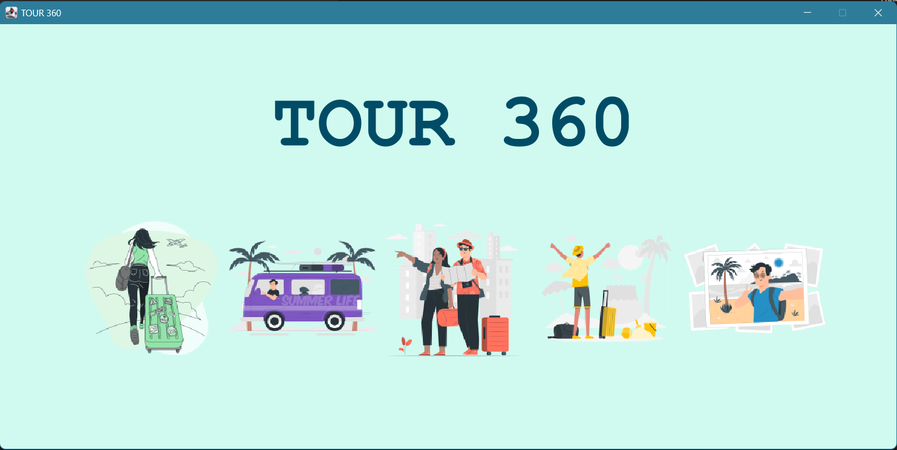
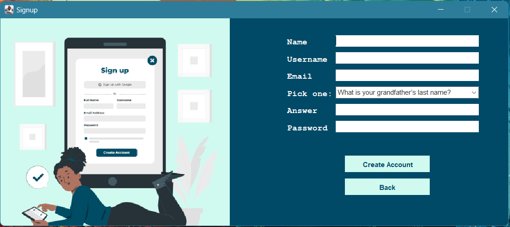
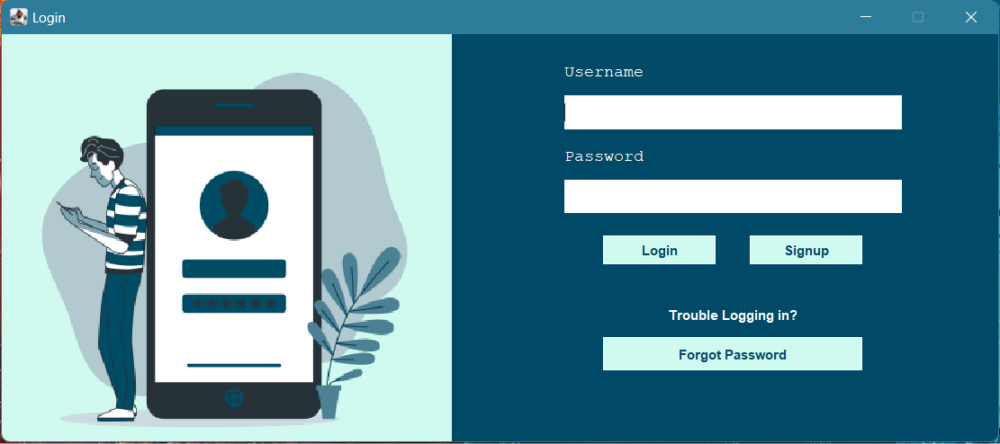
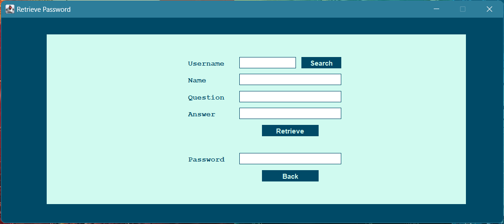
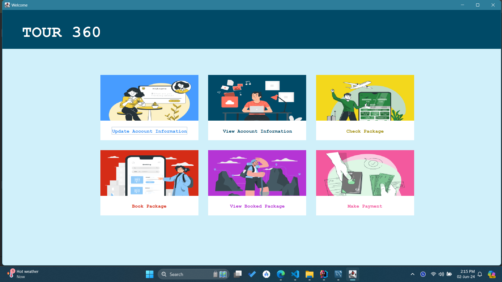
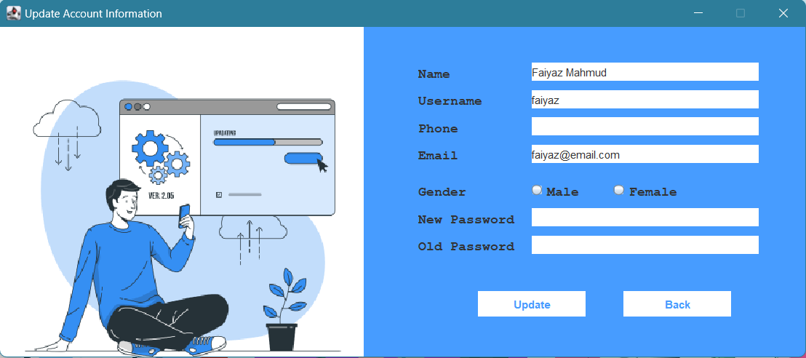
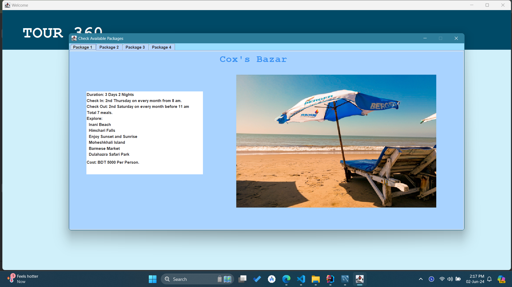
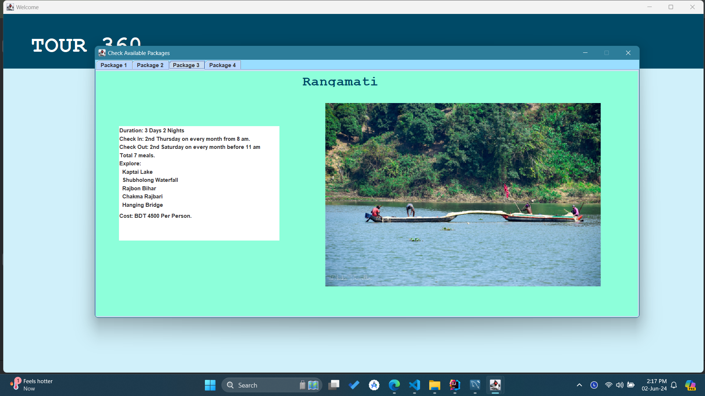
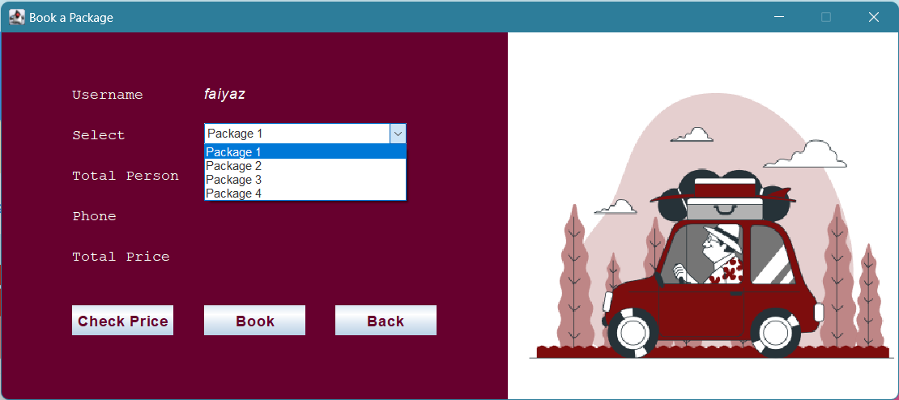

# Tour360

## Overview

Tour360 is a Java-based desktop application developed as a part of the Advanced Programming Laboratory (CSE 2200) course at Khulna University of Engineering and Technology. The application allows users to sign up, log in, retrieve their password using a security question, view and update their account information, and view and book tour packages.

## Features

- **Signup with Security Question:** Users can sign up with a security question for account recovery.
- **Login:** Secure login functionality.
- **Password Recovery:** Retrieve password using the security question if forgotten.
- **Account Management:** View and update account information.
- **Tour Packages:** Browse and book tour packages.

## Application Preview

### Splash Screen

### Signup Screen

### Login Screen

### Password Recovery

### Dashboard

### Update Account Information

### Tour Packages

### Book Packages

## Project Details
This project was developed as part of the course **Advanced Programming Laboratory (CSE 2200)** at **Khulna University of Engineering and Technology**.
- **Platform:** Desktop
- **Programming Language:** Java
- **GUI:** Java Swing
- **Database:** MySQL
- **IDE:** IntelliJ IDEA
